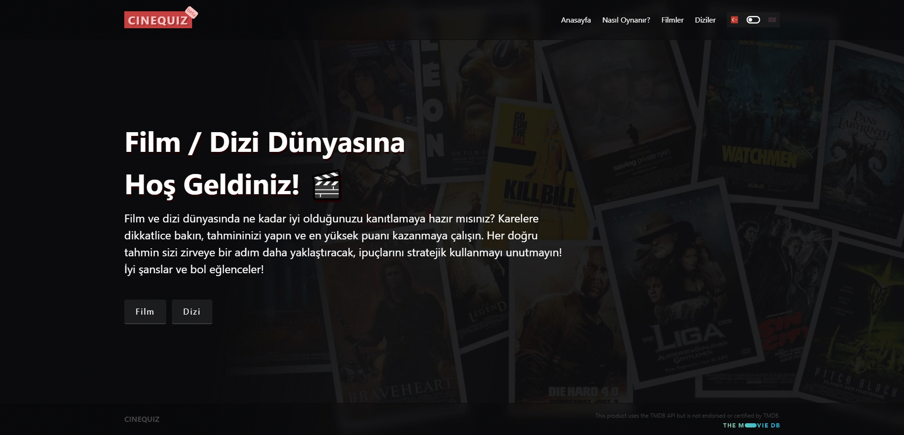

## CineQuiz Film / Dizi Tahmin Oyunu

CineQuiz, oyuncuların resim, video vb. ipuçları yardımıyla doğru filmi veya diziyi tahmin etmeye çalıştığı eğlenceli bir oyundur.

Demo: 

---

### Özellikler

- Resim, video, yapımın çıkış tarihi, oyuncuları, yönetmenleri ve adının karmaşık halinin olduğu ipuçları yardımıyla tahmin yapabilme
- Oyuncuya tanınan "100" can puanı ve her ipucu kullanımının veya yanlış tahminin cana belirli maliyetinin olduğu oyun içi puanlama sistemi
- Maksimum 5 defa kullanılabilen PAS hakkı kullanımı
- Yapılan tahmini input alanına girerken yakın sonuçları gösteren yardımcı detay alanı
- Oyun tamamlandığında alınan puan localStorage'a kayıt edilir ve "En iyi skor" alanında tutulur
- TMDb API entegrasyonu
- Responsive tasarım
- İngilizce-Türkçe dil desteği

---

### Kullanılan Teknolojiler:

- React + Vite.
- React Router DOM
- TMDb API

---

### Kurulum ve Kullanım:

- **Adım 1: Klonlama:** `git clone https://github.com/gokhandemr/cinequiz.git`
- **Adım 2: Proje Klasörünü Açma:** `cd cinequiz`
- **Adım 4: .env Dosyası Örneği:** `VITE_AUTH=****(TMDb API Authorization)`
- **Adım 5: Npm Yükleme:** `npm install`
- **Adım 6: Çalıştırma:** `npm run dev`

---

### İletişim

_gkhandemir96@gmail.com_
