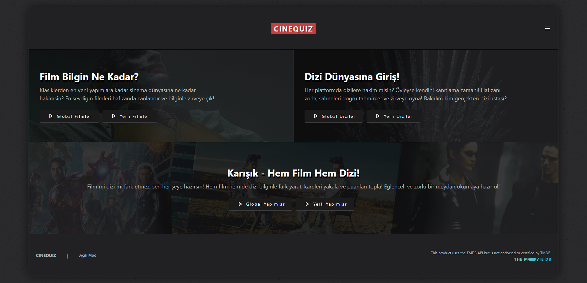

# CineQuiz Film / Dizi Tahmin Oyunu

CineQuiz, oyuncuların film veya diziye ait karelerden yola çıkarak ilgili içeriği tahmin etmeye çalıştığı eğlenceli bir oyunudur.  

## Demo  
[**https://cinequiz.tr/**](https://cinequiz.tr/)  

## Oyunun Özellikleri
### Amaç
- Oyuncular, film veya dizilere ait kareleri inceleyerek doğru içeriğin adını tahmin etmeye çalışır. Her yanlış tahminde, toplam 5 olan can haklarından 1'i eksilir. Tahmin süresi ne kadar kısa olursa ekstra puan kazanılır. Jokerler ve pas haklarını stratejik kullanarak en yüksek puana ulaşmak ve sıralamada yükselmek hedeflenir.
### Jokerler
- Pas Hakkı Jokeri: Oyuncular, maksimum 3 kez kullanabilecekleri pas hakkı ile zorlandıkları soruları atlayabilir.
- Karışık Harf Jokeri: İçeriğin adındaki harfler karıştırılarak sunulur, böylece oyuncuya ipucu sağlanır.
- Ekstra Kare Jokeri: İçeriğe ait farklı sahneler gösterilerek tahmin sürecine yardımcı olunur.

## Kullanılan Teknolojiler ve Araçlar  
- React + Vite
- React Router DOM
- TMDb API
- Firebase

## Kurulum & Çalıştırma 
- **1- Klonlama:** `git clone https://github.com/gokhandemr/cinequiz.git`
- **2- Proje Klasörünü Açma:** `cd cinequiz`
- **3- Firebase Entegrasyonu:** Firabase projesinde size verilen 'firebaseConfig' bilgilerini 'src' klasörü ile aynı seviyede olacak şekilde '.env' dosyası açarak içine kayıt etmelisiniz.
- **4- TMDB API Entegrasyonu:** TMDB sitesinden alınan api key bilgisini yine .env dosyasına yazmalısınız.
- **5- Npm Yükleme:** `npm install`
- **6- Çalıştırma:** `npm run dev`

## İletişim
_gkhandemir96@gmail.com_